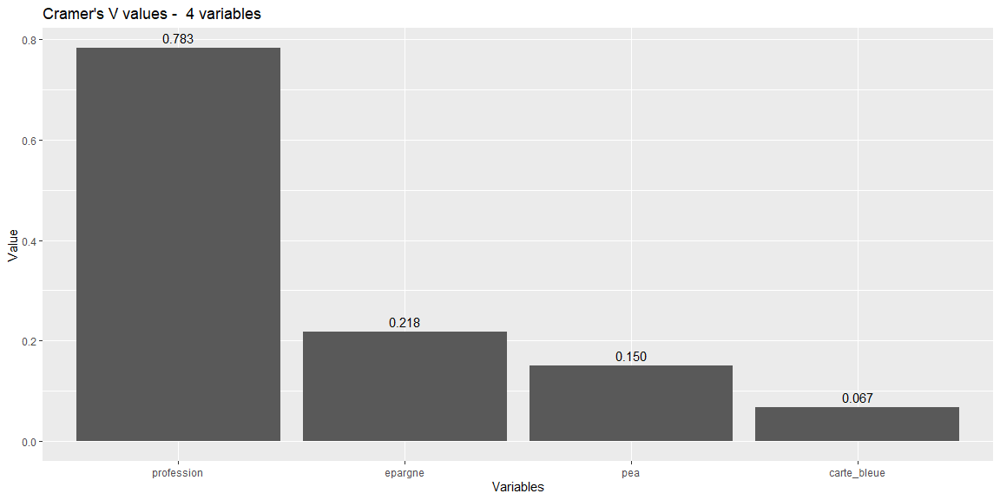
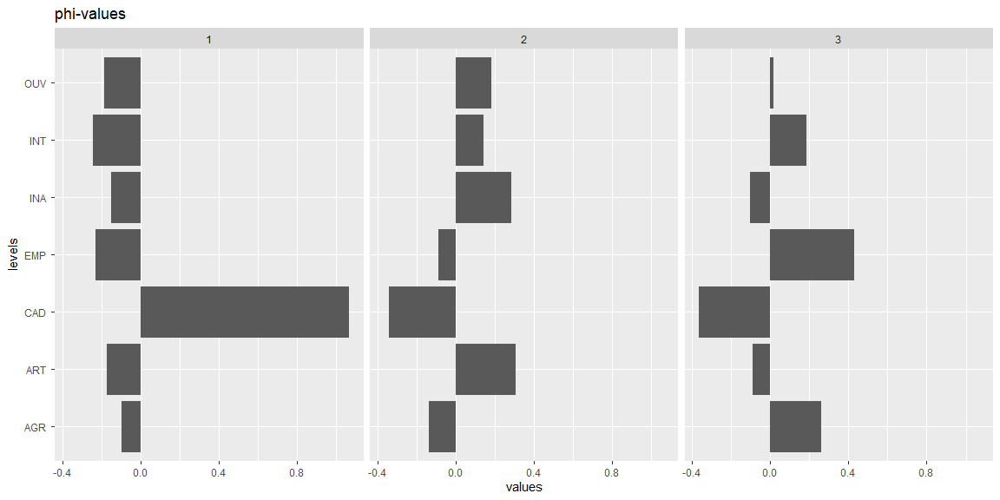
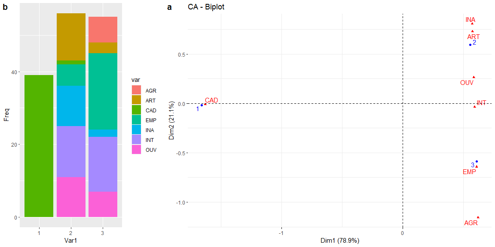
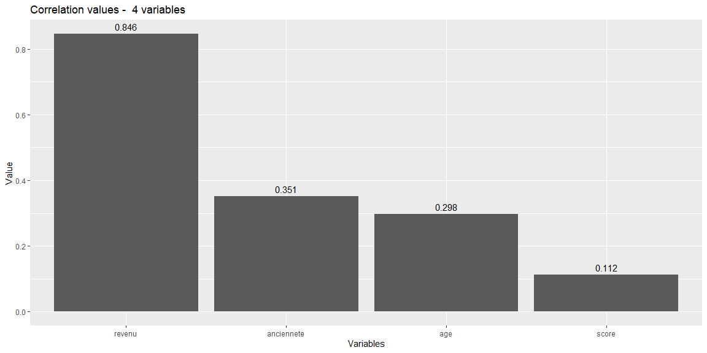
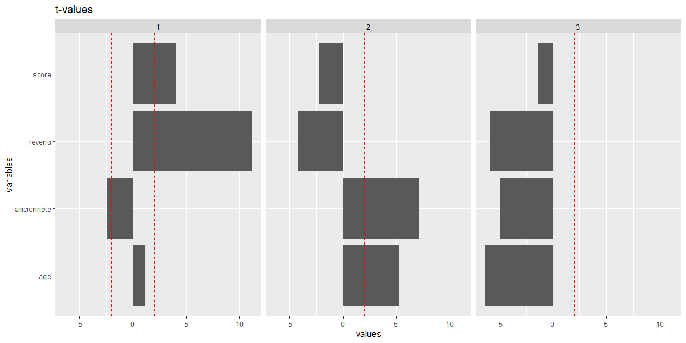
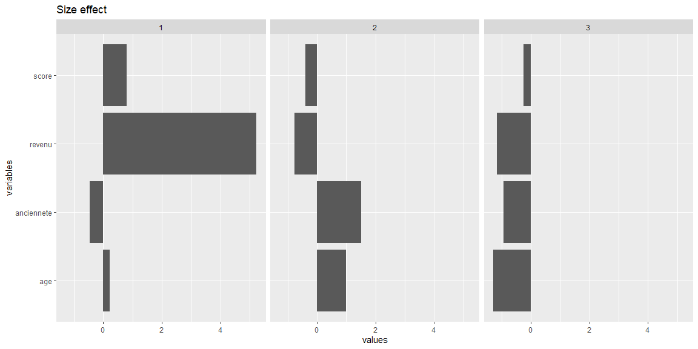
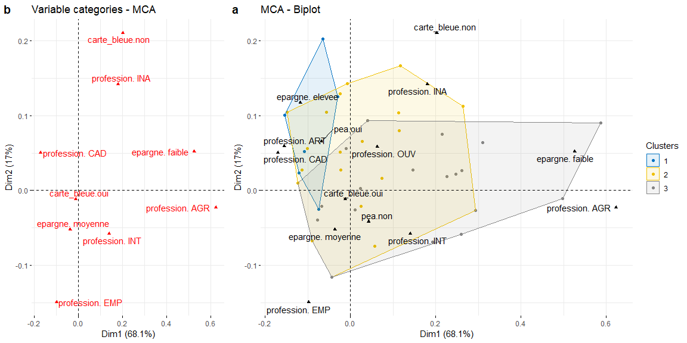
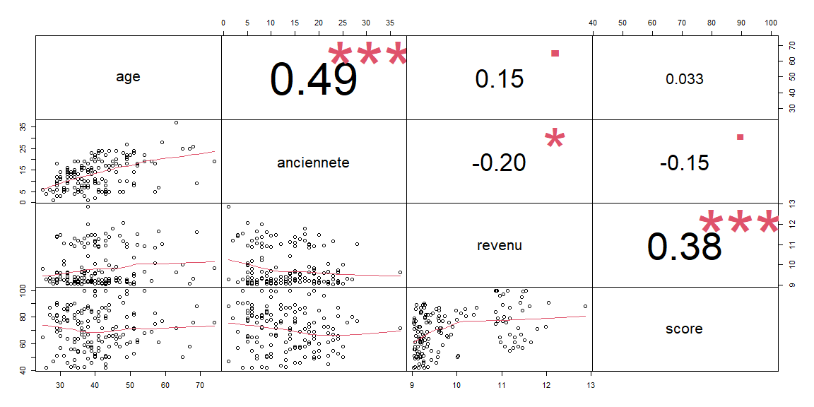
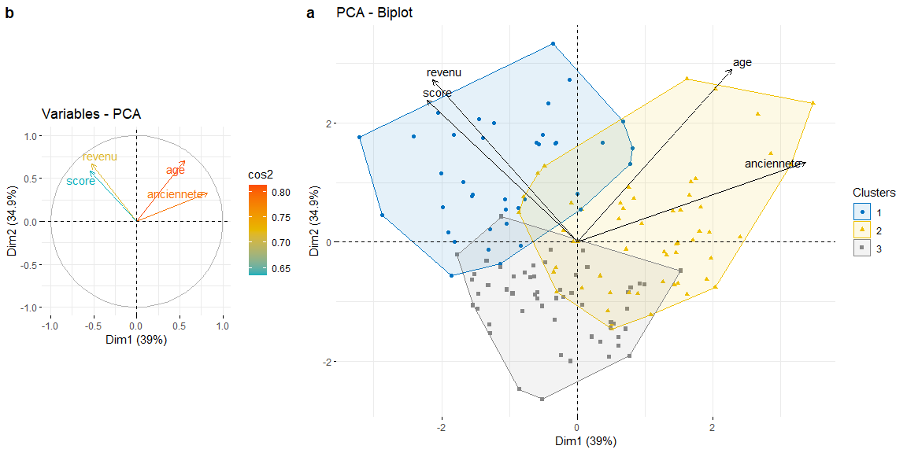
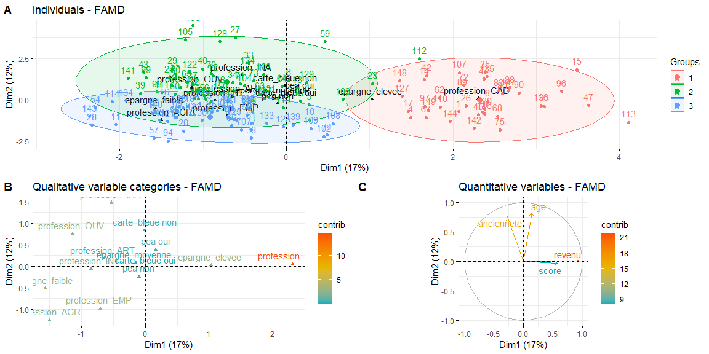

ClustCheck
==========

The ClustCheck package is intended to provide tools to check and analyse
the results of a clustering from a machine learning algorithm. It offers
a combination of evaluation metrics and graphical visualisations to
understand what variables drive the structure of the clusters and to
test the quality of the clustering.

Installing the package
----------------------

    #devtools::install_github("adrienPAVOINE/ClustCheck")

Tutorial for package usage
--------------------------

### Loading the library

Once the package is installed, the library can be load using the
standard commands from R.

    library(ClustCheck)

### Dataset Import

First of all, you need to import a dataset (with numerical, categorical
variables or both). In this example, we’ll be using the BankCustomer
dataset. This dataset is included in the ClustCheck package.

    BankCustomer <- ClustCheck::BankCustomer

The BankCustomer dataset includes information about bank customers and
contains 4 categorical variables and 4 numerical variables. To test the
package with this dataset, you have to call the *Dataset()* function to
create your class object. The function takes a dataframe and a vector of
predicted cluster groups as input. A vector of real cluster groups can
be used as optional input (to be used within the *EvaluateC()*
function).

    cbank <- ClustCheck::Dataset(BankCustomer, BankCustomer$Cluster)

    ## Class correctly instanciated. 
    ## The dataset contains  4  categorical variables and  4  numerical variables.

Now that our dataset has been loaded to the object *cbank*, we can
proceed with the cluster analysis. If you have any doubt about a
function, use **help(nom\_fonction)**, exemple : **help(Dataset)**.

**Note: In the following code, *cbank* is the object instanciated by the
Dataset() function previously shown.**

### Analysing the clustering with single variables

Let’s start our analysis by looking at how single variables influence
the clustering. We can deal with two possible variable types ;
categorical variables and numerical ones. We’ll be starting with the
former. \#\#\#\# Categorical variables

-   Cramer’s V Here, the Cramer’s V values will be computed for the 4
    categorical variables of our dataset. To return the Cramer’s V
    values only between the cluster groups and the variable *profession*
    for example, the variable needs to be entered as a function input. A
    bar graph of the values can be plotted with the function
    *plotVCramer()*.

<!-- -->

    ClustCheck::vcramer(cbank)

    ##                 Cramer
    ## profession  0.78276275
    ## epargne     0.21795453
    ## carte_bleue 0.06733646
    ## pea         0.14985464

    ClustCheck::vcramer(cbank, var = BankCustomer$profession)

    ## Cramer value between the cluster vector and   BankCustomer$profession  =  0.7827627

    ClustCheck::plotVCramer(cbank)

-   V-Test The Test values can be computed either against the modes of a
    categorical variable (i.e. profession) with the function
    *tvalue\_cat* or against the numerical variables with the function
    *tvalue\_num()*. We use *tvalue\_cat()* in our example below.

<!-- -->

    ClustCheck::tvalue_cat(cbank, var = BankCustomer$profession)

    ##    var
    ##           AGR        ART        CAD        EMP        INA        INT 
    ##   1 -0.5975237 -1.4574992 12.2065556 -2.6794878 -1.1582863 -2.9255381
    ##   2 -0.5975237  1.7145135 -4.1415099 -1.0845546  1.4669505  0.8574853
    ##   3  1.0320864 -0.7121871 -4.4387475  3.0042742 -0.6722920  1.2013965
    ##    var
    ##           OUV 
    ##   1 -1.6645303
    ##   2  1.0601473
    ##   3  0.1008806

-   Phi-value The Phi values can be computed against the modes of a
    categorical variable (i.e. profession) with the function
    *phivalue()*. Bar graphs can be plotted with the function
    *plotphi()*.

<!-- -->

    ClustCheck::phivalue(cbank, var = BankCustomer$profession)

    ##    var
    ##        AGR     ART     CAD     EMP     INA     INT     OUV 
    ##   1 -0.0951 -0.1713  1.0690 -0.2320 -0.1502 -0.2413 -0.1840
    ##   2 -0.1381  0.3093 -0.3404 -0.0873  0.2876  0.1440  0.1818
    ##   3  0.2580 -0.0921 -0.3670  0.4309 -0.1031  0.1864  0.0151

    ClustCheck::plotphi(cbank, var = BankCustomer$profession)

-   Correspondance Analysis The clustering can be analysed through
    visualisation by plotting the clusters against the modes of a
    categorical variable (i.e. profession). It shows the frequency of
    the modes in each cluster as well as a plot of the coordinates of
    the clusters centers against the modes of the variable.

<!-- -->

    ClustCheck::vizAFC(cbank, var = BankCustomer$profession)

#### Numerical Variables

Lets’s focus now on the numerical variables of our dataset.

-   Correlation Correlation ratios can be computed for all numerical
    variables. A bar graph of the ratios can be plotted with the
    function *plotcorr()*.

<!-- -->

    ClustCheck::corr_ratios(cbank)

    ##        age anciennete     revenu      score 
    ##  0.2980303  0.3505494  0.8464643  0.1119814

    ClustCheck::plotcorr(cbank)

 -
V-Test call Similar to the categorical variables, test values can be
computed for the numerical variables with the function *tvalue\_num()*.
A bar graph of the values can be plotted with the function
*plottvalue()*.

    ClustCheck::tvalue_num(cbank)

    ##                    1         2         3
    ## age         1.168583  5.278941 -6.362284
    ## anciennete -2.448253  7.143744 -4.941884
    ## revenu     11.150443 -4.234765 -5.898917
    ## score       4.048566 -2.232756 -1.444048

     ClustCheck::plottvalue(cbank)

    ## [1] "Error : input var is missing and required for categorical or mixed data."

-   Effect size Effect size is another way to measure the strength of
    the relationship between variables and cluster groups. Cohen’s
    magnitude description can be used as a useful scale to evaluate this
    strength. In our example below, we can see the overwhelming
    influence of revenue in the cluster group 1. Bar graphs can be
    plotted with the function *plotsizeeff()*.
    <a href="https://en.wikipedia.org/wiki/Effect_size" class="uri">https://en.wikipedia.org/wiki/Effect_size</a>

<!-- -->

    ClustCheck::effectsize(cbank)

    ##                     1          2          3
    ## age         0.2200033  0.9957201 -1.2732108
    ## anciennete -0.4683712  1.4997969 -0.9224839
    ## revenu      5.2245778 -0.7676589 -1.1504799
    ## score       0.8045345 -0.3859882 -0.2480678

    ClustCheck::plotsizeeff(cbank)

### Analysing the clustering with multiple variables

Now we want to look at the influence on our clustering of the
combination of multiple variables. We will need here to use the
principles of Principal Component Analysis.
<a href="https://en.wikipedia.org/wiki/Principal_component_analysis" class="uri">https://en.wikipedia.org/wiki/Principal_component_analysis</a>

#### Categorical variables

The function *get\_MCA()* offers a graphic visualisation of a Multiple
Component Analysis on the categorical variables of the dataset.

    ClustCheck::get_MCA(cbank)

    ## [1] 1 2

\#\#\#\# Numerical variables The function *get\_PCA()* offers a graphic
visualisation of a Principal Component Analysis on the numerical
variables of the dataset.

    ClustCheck::get_PCA(cbank)

\#\#\#\# Mixed variables The function *get\_FAMD()* offers a graphic
visualisation of a Factorial Analysis of Mixed Data. This function is
intended for datasets with mixed data only, like in our case example.

    ClustCheck::get_FAMD(cbank)

### Evaluation metrics

The packages offers the choice of 3 metrics to evaluate the quality of
the clustering : - Silhouette coefficient - Davies-Boulding index - Dunn
index

The *silhouetteC* function returns the silhouette coefficient for each
cluster as well as a computed mean for the whole partition. The
silhouette coefficient varies from -1 to +1. A coefficient close to 1
indicates a good clustering. On the contrary a coefficient close to -1
indicates a poor clustering.
<a href="https://en.wikipedia.org/wiki/Silhouette_(clustering)" class="uri">https://en.wikipedia.org/wiki/Silhouette_(clustering)</a>

    ClustCheck::silhouetteC(cbank)

    ## $cluster_silhouette
    ## [1] 0.4542508 0.1458115 0.1696981
    ## 
    ## $mean_silhouette
    ## [1] 0.2347641

The Davies\_bouldin index is always positive. Zero is a perfect score
and indicates the best clustering. The higher the score, the poorer the
clustering otherwise.
<a href="https://en.wikipedia.org/wiki/Davies%E2%80%93Bouldin_index" class="uri">https://en.wikipedia.org/wiki/Davies%E2%80%93Bouldin_index</a>

    ClustCheck::davies_bouldinC(cbank)

    ## [1] 1.840466

The Dunn index is similar to the Davis-Bouldin in its measure of
clustering quality. The index value should be interpreted differently
though. In this cas, the higher the score, the better the clustering.
<a href="https://simple.wikipedia.org/wiki/Dunn_index" class="uri">https://simple.wikipedia.org/wiki/Dunn_index</a>

    ClustCheck::dunn_indexC(cbank)

    ## [1] 0.915563

### That’s it!

You’ve competed an overview of the package main functions. Hope it will
provide useful tools for happy clustering evaluation!
